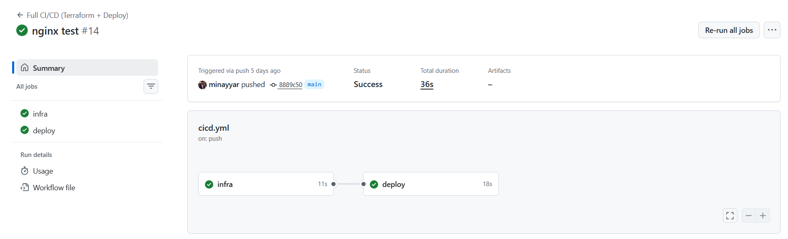
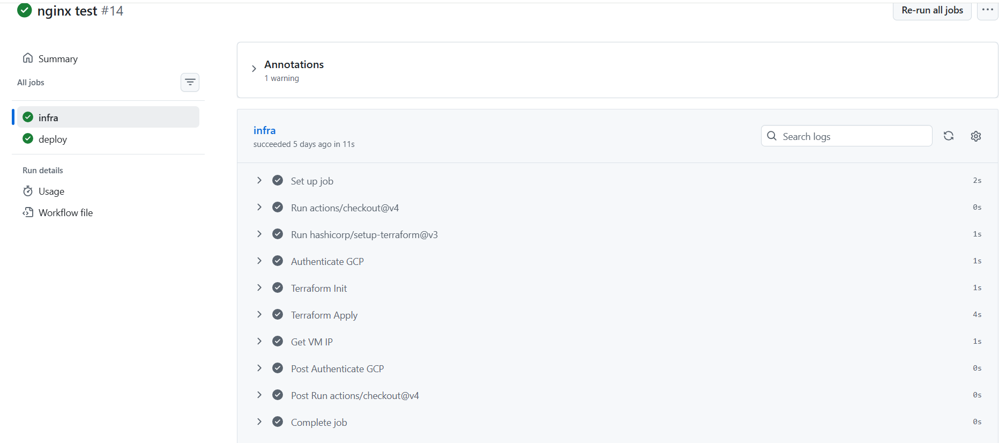
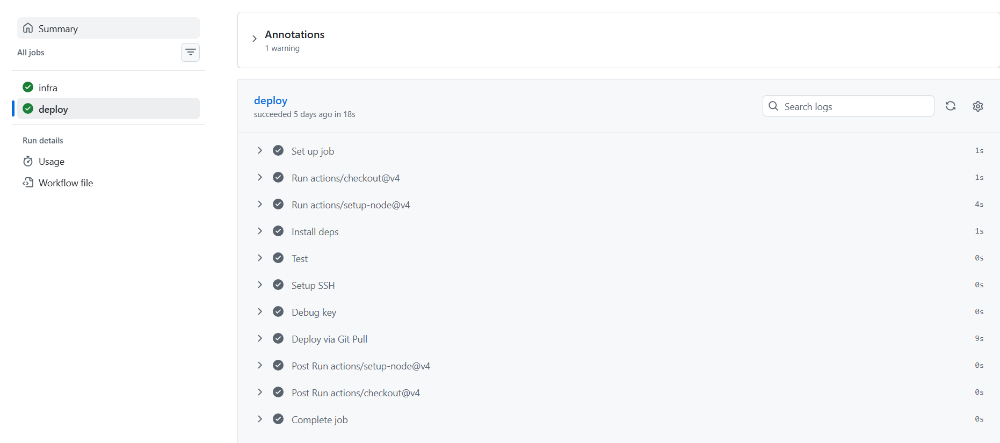
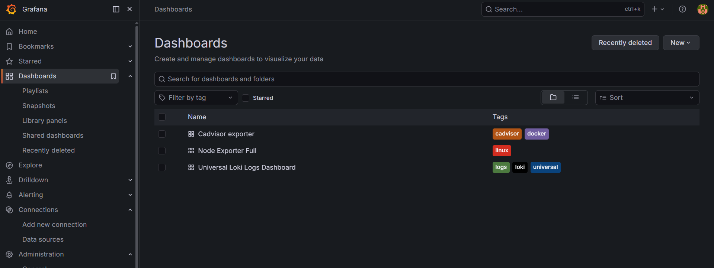
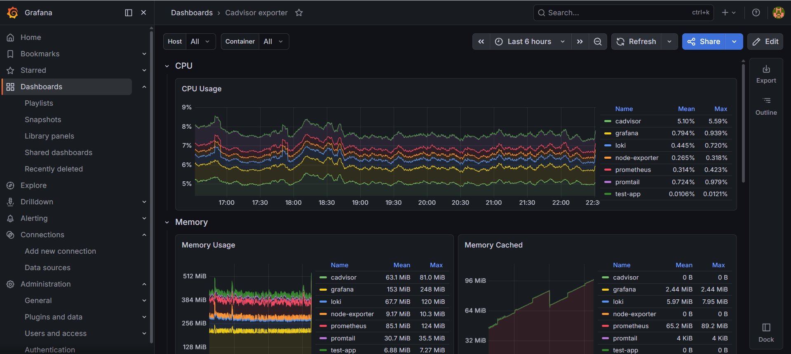
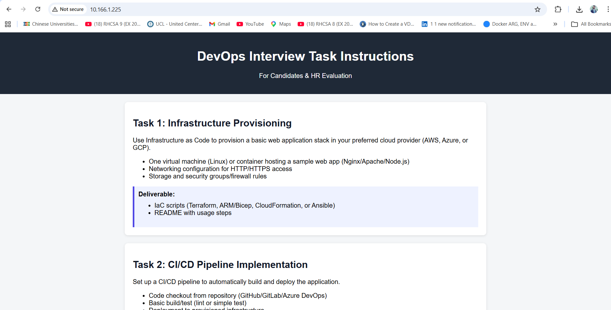

# 🚀 DevOps Project: End-to-End Implementation

## 📌 Overview
This project demonstrates a complete DevOps lifecycle:
- Infrastructure Provisioning (Terraform on GCP)
- CI/CD Pipeline (GitHub Actions)
- Monitoring & Logging (Prometheus, Grafana, Loki)
- Security Best Practices

---

# 🏗️ Task 1: Infrastructure Provisioning
- Created VPC, subnet, firewall rules
- Deployed Ubuntu VM (e2-micro)
- Enabled HTTP/HTTPS access
- Remote state stored in GCS

---

# 🔁 Task 2: CI/CD Pipeline
- Automated Terraform provisioning
- Node.js app build, test, deploy
- SSH-based deployment
- Managed via PM2 + Nginx

---

# 📊 Task 3: Monitoring & Logging
- Prometheus → Metrics
- Node Exporter & cAdvisor → System + container metrics
- Loki + Promtail → Logs
- Grafana → Visualization

---

# 🔐 Task 4: Security
- GitHub Secrets for credentials
- SSH key authentication
- Firewall IP restrictions
- Reverse proxy via Nginx

---

# ⚠️ Challenges & Solutions
- SSH issues → Fixed key formatting
- Terraform state → Used GCS backend
- Monitoring complexity → Used Docker Compose

---

# 📸 Screenshots

## CI/CD Pipeline

## Infra Logs

## Deploy Logs

## Grafana Dashboards

## Loki Logs

## cAdvisor Metrics

## Application Output

---

# 📦 Deliverables
- Terraform IaC
- CI/CD pipeline
- Monitoring stack
- Security implementation

---

## 👨‍💻 Author
Majid Iqbal Nayyar
